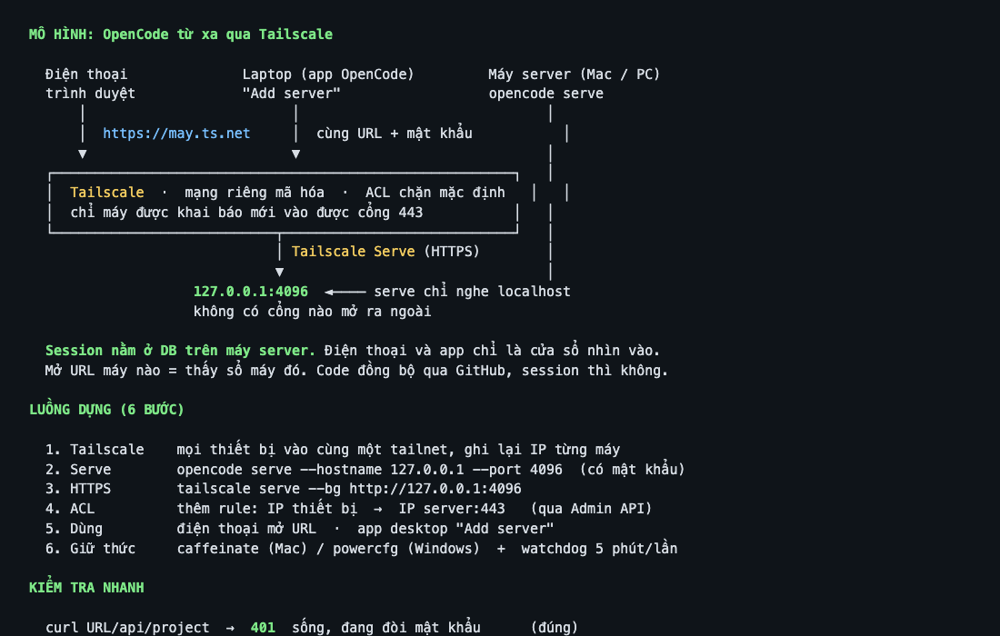

# OpenCode từ xa qua Tailscale — hướng dẫn cho team

> Bản sạch, đưa được cho AI-CLI làm theo từ đầu đến cuối.
> Mô hình này đã chạy ổn định 24/7 (Mac + Windows, kiểm chứng 07/10/2026).
> Mọi giá trị trong tài liệu này là **placeholder** — thay bằng giá trị của chính bạn.

## Mô hình kết nối



```text
   Điện thoại                 Laptop (app desktop)              Máy server (Mac hoặc PC)
   (trình duyệt)              (app OpenCode)                    (chạy opencode serve)
        │                            │                                   │
        │  https://<máy>.ts.net      │  app "Add server"                 │
        │  user: opencode            │  cùng URL + mật khẩu              │
        ▼                            ▼                                   │
   ┌─────────────────────────────────────────────────────────────────┐   │
   │  Tailscale (mạng riêng, mã hóa)                                 │   │
   │  ACL: chỉ máy được khai báo mới vào được cổng 443               │   │
   └──────────────────────────────┬──────────────────────────────────┘   │
                                  │ Tailscale Serve (HTTPS, Let's Encrypt)│
                                  ▼                                      │
                        127.0.0.1:4096  ◄── opencode serve ──────────────┘
                        (chỉ nghe localhost, KHÔNG có cổng nào mở ra ngoài)

   Session nằm ở DB trên chính máy server. Điện thoại và app chỉ là "cửa sổ"
   nhìn vào DB đó — mở URL máy nào là thấy sổ máy đó.
```

Ba nguyên tắc xương sống:

1. **Serve chỉ bind `127.0.0.1`.** Ra ngoài duy nhất qua Tailscale Serve (HTTPS cổng 443).
   Không có cổng thô nào trên mạng — kể cả mạng Tailscale.
2. **ACL chặn mặc định.** Mỗi thiết bị mới phải được khai báo rõ trong policy
   (`IP nguồn → IP server:443`). Không ai "ở trong tailnet" là tự vào được.
3. **Một serve = một thư mục làm việc.** Session tạo từ điện thoại rơi vào đúng
   thư mục đó. Muốn máy khác thì dựng serve khác (mỗi máy một URL).

## Thành phần

| Thành phần | Việc nó làm |
|---|---|
| `opencode serve` | Server web của OpenCode, chỉ nghe `127.0.0.1:4096`, có mật khẩu |
| Tailscale Serve | Proxy HTTPS tailnet-only: `https://<tên-máy>.<tailnet>.ts.net` → cổng 4096 |
| ACL policy | Danh sách "ai được vào cổng 443 của máy nào" |
| Watchdog | Tự phát hiện serve treo và khởi động lại (bắt buộc — xem mục Bẫy) |
| App desktop "Add server" | App trên laptop nối tới serve từ xa để xem/chat tiếp session |

## Làm theo — checklist

Làm lần lượt, mỗi bước có lệnh kiểm tra. Chi tiết lệnh nằm trong `scripts/`.

### 1. Tailscale cho mọi thiết bị

- Cài Tailscale trên máy server, laptop và điện thoại. Đăng nhập **cùng một tailnet**.
- Bật MagicDNS (mặc định) để có tên `https://<tên-máy>.<tailnet>.ts.net`.
- Ghi lại IP Tailscale của từng máy: `tailscale ip -4`.

### 2. Dựng serve trên máy server

**macOS** — LaunchAgent tự chạy khi đăng nhập, tự sống lại khi chết:

```bash
# Xem script đầy đủ, có chú thích: scripts/macos/install-serve.sh
export OPENCODE_SERVER_PASSWORD="$(openssl rand -base64 18 | tr -d '/+=')"
echo "Mật khẩu (lưu lại, chỉ hiện 1 lần): $OPENCODE_SERVER_PASSWORD"
./scripts/macos/install-serve.sh
```

**Windows** — Scheduled Task chạy khi đăng nhập:

```powershell
# Xem script đầy đủ: scripts/windows/install-serve.ps1
./scripts/windows/install-serve.ps1 -Password "<mật khẩu tự sinh>"
```

Kiểm tra: `curl -s -o /dev/null -w '%{http_code}\n' http://127.0.0.1:4096/` phải ra `200`.

### 3. Bọc HTTPS bằng Tailscale Serve

```bash
tailscale serve --bg http://127.0.0.1:4096
tailscale serve status
```

Kiểm tra từ máy khác trong tailnet:

```bash
curl -s -o /dev/null -w '%{http_code}\n' https://<tên-máy>.<tailnet>.ts.net/api/project
# 401 = đúng (serve sống, đang đòi mật khẩu). 502 = serve chết. 000 = ACL chặn hoặc Tailscale chưa nối.
```

### 4. Mở ACL cho từng thiết bị

Policy dạng [HuJSON](https://tailscale.com/kb/1337/acl-syntax). Thêm một rule + một test
cho mỗi thiết bị mới — dùng **Admin API**, đừng sửa bằng web editor (dễ mất comment và test):

```bash
# 1. Lấy policy hiện tại + ETag
curl -s -u "$TS_API_KEY:" -D headers.txt -H 'Accept: application/hujson' \
  https://api.tailscale.com/api/v2/tailnet/-/acl -o acl.hujson
ETAG=$(grep -i '^etag' headers.txt | tr -d '\r' | awk '{print $2}')

# 2. Sửa acl.hujson: thêm rule vào "grants"/"acls" và thêm test tương ứng
#    {"action":"accept","src":["<ip-điện-thoại>"],"dst":["<ip-server>:443"]}

# 3. Gửi lại kèm ETag (If-Match chống ghi đè bản người khác vừa sửa)
curl -s -u "$TS_API_KEY:" -X POST -H 'Content-Type: application/hujson' \
  -H "If-Match: $ETAG" --data-binary @acl.hujson \
  https://api.tailscale.com/api/v2/tailnet/-/acl -w '\nHTTP %{http_code}\n'
# HTTP 200 = đã áp dụng. API tự chạy tests trong policy — test fail thì bị từ chối.
```

Token API tạo ở Admin Console → Settings → Keys, lưu vào file env `chmod 600`, **không commit**.

### 5. Dùng từ điện thoại và từ app desktop

- **Điện thoại:** mở `https://<tên-máy>.<tailnet>.ts.net`, đăng nhập user `opencode` + mật khẩu.
- **App desktop trên laptop:** Settings → Server → **Add server** → dán URL + user + mật khẩu.
  App sẽ hiện session của máy server ngay trong giao diện, agent chạy trên CPU máy server.
- **Add server kiểu SSH:** app tự SSH vào máy đích (dùng SSH key có sẵn) rồi chạy opencode
  theo từng thư mục project. Dùng cho máy **không** dựng serve sẵn. Máy đã dựng serve thì
  dùng kiểu HTTPS ở trên, không cần SSH.

### 6. Giữ máy server luôn thức

- **macOS:** `caffeinate -s` qua LaunchAgent — không ngủ hệ thống khi cắm sạc
  (màn hình vẫn ngủ bình thường, đỡ nóng), tự vô hiệu khi rút sạc.
- **Windows:** `powercfg /change standby-timeout-ac 0` (đã là mặc định nhiều máy).
- **Khe hở chung:** sau khi **khởi động lại**, serve chỉ lên khi có người đăng nhập
  (LaunchAgent/Scheduled Task đều là trigger lúc login). Login một lần là mọi thứ tự chạy.

## Mô hình session — đọc trước khi hỏi "sao không đồng bộ"

```text
   Điện thoại ──► URL máy A ──► DB của máy A  (thấy session tạo trên máy A)
   App laptop ──► Add server A ► DB của máy A  (thấy đúng những session đó)
   App laptop ──► Local server ► DB của laptop (sổ RIÊNG, không liên quan máy A)

   Máy A ◄══ GitHub ══► Máy B     code thì đồng bộ qua git
   DB máy A  ✗ không nối ✗  DB máy B    session KHÔNG đồng bộ qua máy
```

- Muốn làm việc ở hai nơi trên **cùng một sổ session**: cả hai nơi cùng trỏ vào **một** server.
- Muốn mỗi máy một sổ: mỗi máy một URL, chuyển qua lại trong app bằng danh sách server.
- Code/project đồng bộ bằng git như bình thường — việc đó độc lập với session.

## Bẫy đã trả giá (đừng mắc lại)

| Triệu chứng | Nguyên nhân | Cách xử lý |
|---|---|---|
| Serve "đang chạy" nhưng URL trả **502** | Process treo không thoát (vẫn sống nên KeepAlive không khởi động lại) nhưng không mở socket | Watchdog định kỳ `curl 127.0.0.1:4096`, fail thì restart. Có sẵn trong `scripts/macos/` |
| `bootstrap` LaunchAgent báo lỗi 5 ngay sau `bootout` | Lỗi tạm thời của launchd | Chờ 3 giây rồi bootstrap lại, lặp tối đa 5 lần |
| Điện thoại "đã bật Tailscale" mà không vào được | ACL chặn mặc định. `tailscale status` chỉ liệt kê máy **được phép thấy** — không phải danh sách đầy đủ | Thêm rule ACL cho IP điện thoại (bước 4). Danh sách máy thật nằm ở Admin Console |
| Mọi session tạo từ điện thoại rơi vào thư mục rỗng `/` | Serve chạy với thư mục làm việc mặc định | Đặt `WorkingDirectory` của LaunchAgent/Scheduled Task = thư mục project |
| Điện thoại không chuyển được project | Bản OpenCode 2.0.22: một process serve = một thư mục, tham số `?directory=` bị bỏ qua | Mỗi máy một serve; hoặc nâng bản khi upstream hỗ trợ |
| `tailscale serve` trỏ vào chính IP Tailscale của máy thì HTTP treo | Serve không proxy vòng về IP tailnet của chính nó | Luôn trỏ `http://127.0.0.1:4096` |
| Windows báo cổng "already in use" dù netstat trống | Dải cổng bị Hyper-V/WinNAT giữ (`netsh int ipv4 show excludedportrange protocol=tcp`) | Chọn cổng ngoài dải bị giữ |
| Sửa ACL trên web editor không ăn | Ô soạn thảo khó tự động hóa, dễ lưu thiếu tests | Dùng Admin API + `If-Match` như bước 4 |

## Bảo mật

- Không commit: mật khẩu serve, API token Tailscale, file `auth.json`/`opencode.json` thật.
- Mật khẩu đặt qua biến môi trường `OPENCODE_SERVER_PASSWORD`, sinh ngẫu nhiên từng máy.
- ACL chỉ mở đúng `IP thiết bị → IP server:443`. Không mở dải cổng, không mở tag rộng.
- Thu hồi token API Tailscale ở Admin Console → Settings → Keys khi không dùng nữa.
